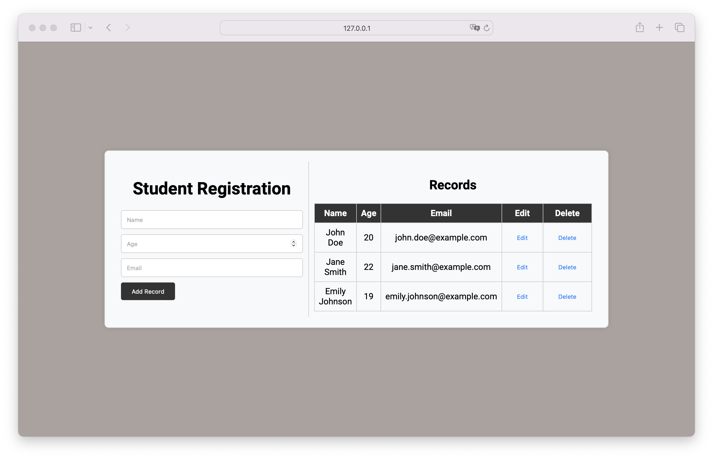

# Student Registry

**Student Registry** is a practical application that employs the **CRUD** (Create, Read, Update, Delete) approach to manage student information. It allows users to input names, ages, and email addresses, organizing these records into a table with options to perform these basic data operations. Ideal for educational environments, it facilitates efficient management of student data.

## Demo

Click the image to view the demonstration.

## Tech Stack

**Client:** HTML, CSS, JavaScript

## Prerequisites

- **Visual Studio Code (VSCode)**: You can download it from [Visual Studio Code](https://code.visualstudio.com/).

## Installation Steps

### Download the project:

1. Download the project from the repository or directly as a ZIP file.

### Open the project in Visual Studio Code:

1. Unzip the ZIP file (if you downloaded the project as a ZIP).
2. Open Visual Studio Code.
3. Select `File` > `Open Folder` and navigate to the downloaded project folder.

### Run the application:

1. If you're only using HTML, CSS, and JavaScript, simply open the `index.html` file in your preferred web browser.
2. Alternatively, you can use the Live Server extension in VSCode to run the application locally:
   - Install the **Live Server** extension from the VSCode marketplace.
   - Right-click the `index.html` file and select `Open with Live Server`.

That's it! You should now be able to see and use the **Student Registry** application in your browser.

## Author

- [@jorgedoiany](https://github.com/jorgedoiany)
