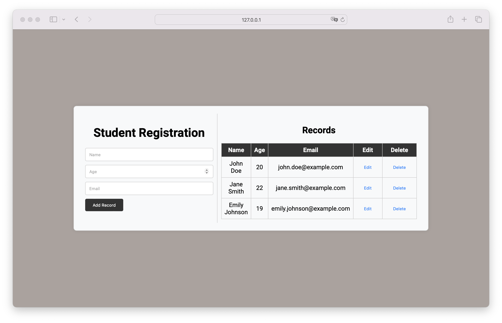

# Student Registry

[](https://github.com/jorgedoiany/student-registry/actions)
[](./LICENSE)
[](https://prettier.io/)
[](./CONTRIBUTING.md)

A modern, professional **Student Registry** application demonstrating industry-standard development practices. Built with vanilla JavaScript using a modular architecture, comprehensive testing, and automated CI/CD workflows.

## ✨ Features

- 🎯 **Full CRUD Operations** - Create, Read, Update, and Delete student records
- 🔍 **Real-time Search** - Debounced search functionality with instant results
- ✅ **Form Validation** - Comprehensive client-side validation with real-time feedback
- 💾 **Persistent Storage** - LocalStorage integration with abstraction layer
- 🎨 **Professional UI** - Toast notifications and modal confirmations
- ♿ **Accessible** - ARIA labels, semantic HTML, and keyboard navigation
- 📱 **Responsive Design** - Mobile-first approach with fluid layouts
- 🧪 **Well-Tested** - 32+ unit tests with Vitest
- 🔄 **CI/CD Pipeline** - Automated linting, testing, and builds
- 📦 **Modern Tooling** - Vite, ESLint, Prettier, and Husky

## 🏗️ Architecture

The project follows a modular architecture with clear separation of concerns:

```
src/
├── js/
│   ├── services/           # Business logic layer
│   │   ├── StorageService.js      # LocalStorage abstraction
│   │   ├── ValidationService.js   # Form validation rules
│   │   └── StudentService.js      # Student CRUD operations
│   ├── components/         # UI components
│   │   ├── StudentForm.js         # Form handling
│   │   ├── StudentTable.js        # Table rendering
│   │   ├── Toast.js              # Toast notifications
│   │   ├── Modal.js              # Modal dialogs
│   │   └── LoadingSpinner.js     # Loading states
│   ├── utils/             # Utility functions
│   │   └── dom.js                # DOM helpers
│   └── app.js             # Application controller
├── styles/
│   └── main.css           # Application styles
tests/
├── unit/                  # Unit tests
│   ├── StorageService.test.js
│   └── ValidationService.test.js
└── setup.js              # Test configuration
```

### Design Patterns

- **Service Layer Pattern**: Business logic separated from UI
- **Component Pattern**: Reusable, self-contained UI components
- **Observer Pattern**: Event-driven architecture with callbacks
- **Singleton Pattern**: Shared instances for Toast and Modal
- **Repository Pattern**: Storage abstraction for data persistence

## 🚀 Demo

[](https://drive.google.com/file/d/1Uaf4biUzlaE5K_ZcUGnW4C4T83iv3ngv/view?usp=sharing)

_Click the image to view the live demonstration_

## 🛠️ Tech Stack

### Core Technologies

- **HTML5** - Semantic markup with accessibility features
- **CSS3** - Modern styling with flexbox, animations, and media queries
- **JavaScript (ES6+)** - Modules, classes, async/await, and modern APIs

### Development Tools

- **[Vite](https://vitejs.dev/)** - Fast development server and build tool
- **[Vitest](https://vitest.dev/)** - Unit testing framework
- **[ESLint](https://eslint.org/)** - Code linting with flat config
- **[Prettier](https://prettier.io/)** - Code formatting
- **[Husky](https://typicode.github.io/husky/)** - Git hooks for quality control
- **[lint-staged](https://github.com/okonet/lint-staged)** - Run linters on staged files

### CI/CD

- **GitHub Actions** - Automated testing and builds on every PR

## 📋 Prerequisites

- **Node.js** >= 18.0.0
- **npm** >= 9.0.0
- **Git** >= 2.40.0

## 🔧 Installation & Setup

### 1. Clone the repository

```bash
git clone https://github.com/jorgedoiany/student-registry.git
cd student-registry
```

### 2. Install dependencies

```bash
npm install
```

### 3. Start development server

```bash
npm run dev
```

The application will be available at `http://localhost:5173`

## 📜 Available Scripts

| Script                  | Description                                   |
| ----------------------- | --------------------------------------------- |
| `npm run dev`           | Start Vite development server with hot reload |
| `npm run build`         | Build optimized production bundle             |
| `npm run preview`       | Preview production build locally              |
| `npm run lint`          | Run ESLint on all JS/HTML files               |
| `npm run lint:fix`      | Auto-fix ESLint errors                        |
| `npm run format`        | Format code with Prettier                     |
| `npm run format:check`  | Check code formatting                         |
| `npm test`              | Run unit tests in watch mode                  |
| `npm run test:ui`       | Run tests with Vitest UI                      |
| `npm run test:coverage` | Generate test coverage report                 |

## 🧪 Testing

The project includes comprehensive unit tests for critical business logic:

```bash
# Run tests in watch mode
npm test

# Run tests once with coverage
npm run test:coverage

# Run tests with UI
npm run test:ui
```

### Test Coverage

- **StorageService**: 10 tests covering CRUD operations and error handling
- **ValidationService**: 22 tests covering all validation rules and edge cases

## 🤝 Contributing

Contributions are welcome! Please read our [Contributing Guidelines](./CONTRIBUTING.md) before submitting a PR.

### Development Workflow

1. Fork the repository
2. Create a feature branch: `git checkout -b feature/amazing-feature`
3. Make your changes and commit: `git commit -m 'feat: add amazing feature'`
4. Push to the branch: `git push origin feature/amazing-feature`
5. Open a Pull Request

**Note**: This project uses [Conventional Commits](https://www.conventionalcommits.org/) and runs automated checks on every commit.

## 🗺️ Roadmap

- [x] Modular architecture with service/component separation
- [x] Comprehensive unit tests
- [x] CI/CD pipeline with GitHub Actions
- [x] Toast notifications and modal confirmations
- [x] Debounced search functionality
- [ ] End-to-end tests with Playwright
- [ ] RESTful API integration
- [ ] Advanced filtering and sorting
- [ ] Export data to CSV/PDF
- [ ] Dark mode support
- [ ] Internationalization (i18n)

## 📄 License

This project is licensed under the MIT License - see the [LICENSE](./LICENSE) file for details.

## 👤 Author

**Jorge Peguero**

- GitHub: [@jorgedoiany](https://github.com/jorgedoiany)
- Email: jorgedoiany@github.com

## 🙏 Acknowledgments

- Inspired by modern frontend development practices
- Built with passion for clean, maintainable code
- Designed to showcase professional development skills

---

<p align="center">Made with ❤️ by Jorge Peguero</p>
